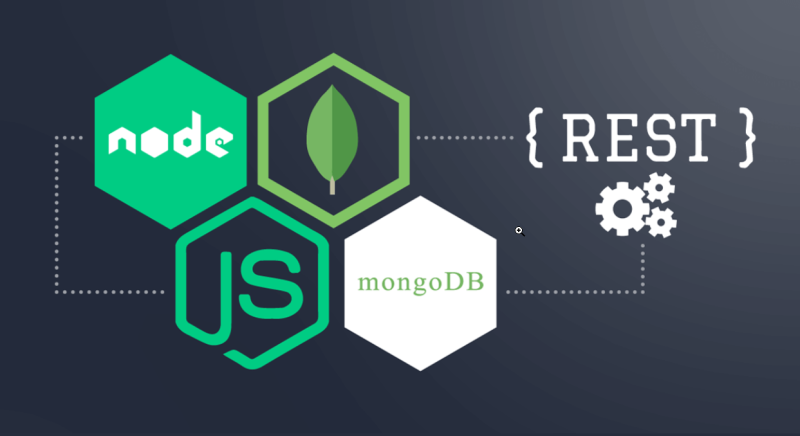

<h1 align="center">Workshop contruyendo una Api Rest con Node.js</h1>

<h4 align="center">
Node.js + Koa.js + Mongoose + EsLint
</h4>




## Tabla de Contenido

- [Tabla de Contenido](#tabla-de-contenido)
- [Introducción](#introducción)
- [Explicación del Caso de Uso](#explicación-del-caso-de-uso)
- [Ciclo de Vida de las Solicitudes HTTP en nuestra API](#ciclo-de-vida-de-las-solicitudes-http-en-nuestra-api)
- [Requisitos](#requisitos)
- [Listado de Episodios del Curso](#listado-de-episodios-del-curso)
- [Stack](#stack)
- [Estructura del Proyecto](#estructura-del-proyecto)

## Introducción
Este Workshop intenta ayudar a comprender como construir una Api Rest usando Node.js con la librería Koa.js. Dividiremos el taller en varias sesiones que llamaremos Episodios, en cada uno agregaremos algún complemento que nos ayudará a entender como ir armando nuestro proyecto de Api Rest.

## Explicación del Caso de Uso
Nuestra api de ejemplo es muy simple, expondrá algunos métodos para poder consultar los datos de contactos que tenemos en una base de datos de MongoDB. Tambien nos permitirá crear nuevos contactos o actualziar sus datos.

## Ciclo de Vida de las Solicitudes HTTP en nuestra API
Cada vez que un usuario realiza una petición por ejemplo a http://localhost:3000/person ya sea que realiza un GET o un POST (con los parámetros adecuados), nuestra aplicación escucha a través de los enrutamientos (routes) que hemos definido y esto dispara todo el flujo de invocaciónes necesarias para finalzar el procesamiento de cada solicitud. En la siguiente imagen se muestra como es el flujo de la petición que pasa entre los elemntos más importantes de nuestra api.


## Requisitos
Antes de empezar revisa ue cumplas con los siguientes requisitos:
- [Node.js](https://nodejs.org/) puede ser la version LTS o la actual
- [Git](https://git-scm.com/)
- [Visual Studio Code](https://code.visualstudio.com/)
- Extensión de VS Code [EditorConfig for VS Code](https://marketplace.visualstudio.com/items?itemName=EditorConfig.EditorConfig)
- Extensión de VS Code [ESLint](https://marketplace.visualstudio.com/items?itemName=dbaeumer.vscode-eslint)
- Extensión de VS Code [Path Intellisense](https://marketplace.visualstudio.com/items?itemName=christian-kohler.path-intellisense)
- Extensión de VS Code [Visual Studio IntelliCode](https://marketplace.visualstudio.com/items?itemName=VisualStudioExptTeam.vscodeintellicode)
- Extensión de VS Code [YAML](https://marketplace.visualstudio.com/items?itemName=redhat.vscode-yaml)
- Extensión de VS Code [Prettier](https://marketplace.visualstudio.com/items?itemName=esbenp.prettier-vscode)
- Extensión de VS Code [npm Intellisense](https://marketplace.visualstudio.com/items?itemName=christian-kohler.npm-intellisense)
- Extensión de VS Code [gitignore](https://marketplace.visualstudio.com/items?itemName=codezombiech.gitignore)

## Listado de Episodios del Curso
En cada episodio iremos complementando nuestro proyecto.

- [Episodio 1: Creando mi primera API rest en Node.js y MongoDB](episodes/README-episode-1.MD)
- [Episodio 2: Implementando validaciones de request y mejores prácticas de manejo de errores](episodes/README-episode-2.MD)
- [Episodio 3: Documentando y probando nuestra api](episodes/README-episode-3.MD)
- [Episodio 4: Desplegando nuestra api en la nube](episodes/README-episode-4.MD)

## Stack
- [Koa](https://github.com/koajs/koa) - Middleware para node.js la cual usa funciones asincronas ES2017. Esta librería esta hecha por el equipo de express, y es más ligera que express.
- [Mongoose](https://mongoosejs.com/) - proporciona una solución directa basada en esquemas para modelar los datos de su aplicación con MongoDB
- [EsLint](https://eslint.org/) - ESLint es una herramienta para identificar e informar sobre ruptura de estandares encontrados en el código ECMAScript / JavaScript.
- [Prettier](https://prettier.io/) - Formateador de código, que nos ayuda a mantener limpio y alienado a los estandares.
- [@hapi/joi](https://www.npmjs.com/package/@hapi/joi) - Nos permite definir esquemas de validación, lo cual nos da la oportunidad de validar los parametros que recibamos en las solicitudes http.
- [swagger2](https://github.com/carlansley/swagger2#readme) - Lo usaremos para cargar la documentación de nuestra api
- [winston](https://github.com/winstonjs/winston#readme) - Un logger poderoso y popular en node.js
- [yenv](https://github.com/jeffijoe/yenv#readme) - Nos permite manejar variables de entorno desde un archivo YAML
- [jest](https://github.com/facebook/jestt) - Un framework muy popular para Testing
- [node-mocks-http](https://github.com/howardabrams/node-mocks-http) - Librería para mocks http para testing de express y koa
- [supertest](https://github.com/visionmedia/supertest#readme) - Modulo que nos permite realizar pruebas de solicitudes http
- [cross-env](https://github.com/kentcdodds/cross-env#readme) - Facilita establecer el valor de la variable de entorno NODE_ENV

## Estructura del Proyecto
```
|-- api-rest-nodejs-workshop
    |-- .editorconfig
    |-- .eslintignore
    |-- .eslintrc.yml
    |-- .gitignore
    |-- env-example.yaml
    |-- env.yaml
    |-- package-lock.json
    |-- package.json
    |-- README.md
    |-- src
        |-- routes.js
        |-- server.js
        |-- controllers
        |   |-- person.controller.js
        |-- models
        |   |-- person.model.js
        |-- repositories
        |   |-- person.repository.js
        |-- routes
        |   |-- person.route.js
        |-- schemas
        |   |-- person.schema.js
        |-- utils
```
